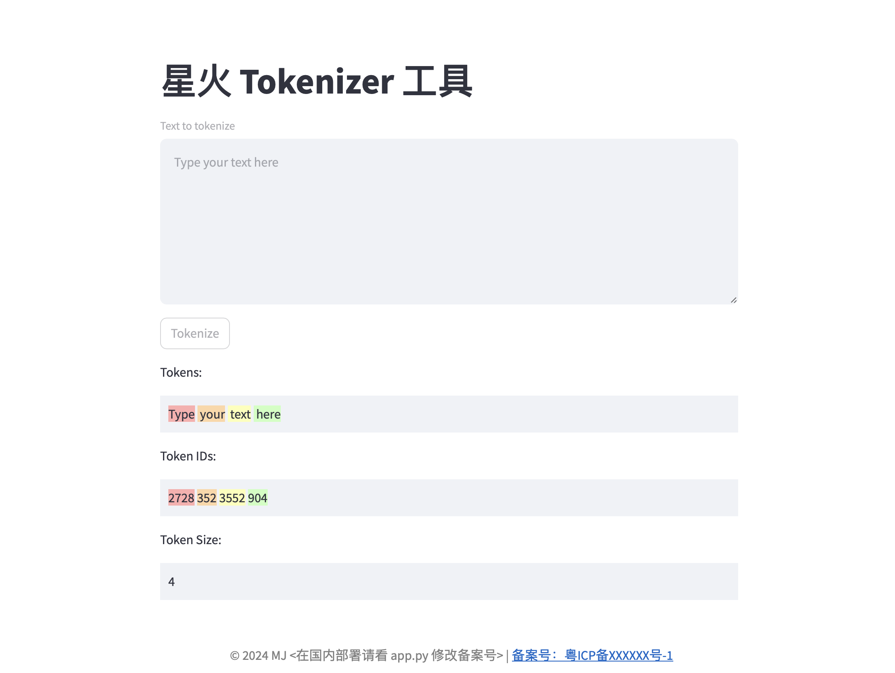

# 星火 Tokenizer 工具

在开发大模型应用中 Token 的使用不仅关乎成本还是关乎速度，基于星火的开源大模型资料，简单的制作了一个星火的 Tokenizer 工具



## 使用说明

1. git clone https://github.com/mjason/spark_tokenizer.git
2. docker compose up

注意：
- 如果要部署到自己的服务器需要关注一下 app.py 里面的备案说明
- 没有官方的 docker 镜像需要自己编译
- python 要运行的话，参考 dockerfile 即可

在中国使用，需要用以下环境变量展示备案信息
```shell
export SHOW_ICP_INFO=true
export COMPANY_NAME='实际公司名称'
export ICP_NUMBER='实际备案号'
```

## 开源协议
Apache License 2.0